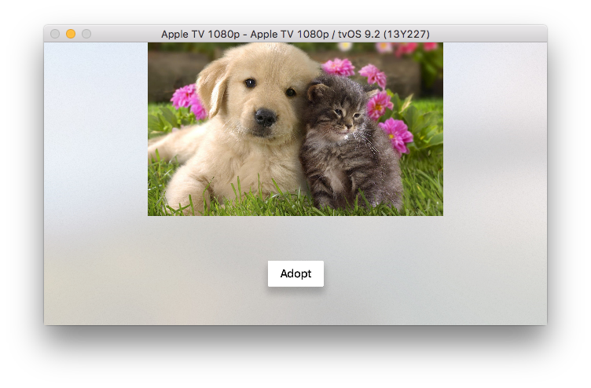

# Pet-Adopt Demo App # 

## Overview ##
This demo app will walk you through

1.  How to initialize Optimizely
2.  How to bucket users into an experiment.
3.  How to track conversion events.
4.  How to view the experiment's results.

This is a dead simple demo that shows you the basics of getting started with Optimizely. By default, the Pet-Adopt App will show you a picture of a puppy and a kitten on the main screen above a button that says Adopt. The demo app is setup up to run an experiment that will test whether dogs or cats are more likely to generate interest in adoption. 

Using the instructions below, you will run the app locally and mimic bucketing users with each app launch. The app will generate a random user ID, and Optimizely will bucket the simulated user into the experiment and display the variation on the screen. The variation a specific user will see is deterministic but not sticky. As long as the experiment conditions remain the same, the user will always get the same variation based on the hash that is generated form the user ID, however, if the experiment is altered, such as changing the traffic allocation, the variation the user is bucketed into may change.

## Learning to Experiment with Optimizely ##
### Getting Started ##

1.  Clone this repo locally
2.  Open Pet-Adopt.xcodeproj with Xcode
3.  Run the app on your tvOS simulator to see the default behavior

### Creating your First Experiment ##

1.  Log in to you Optimizely [Account](https://app.optimizely.com/signin)
2.  Create a new custom project (record your project ID)
3.  Create a new experiment called "Basic_Experiment"
4.  Create one variation called "Dogs" and one variation called "Cats"
5.  Create a new goal called "Adopt_Clicked" and add it to this experiment
6.  Run the experiment

You can also follow these [instructions](http://developers.optimizely.com/server/getting-started/index.html?language=objectivec) for creating your first experiment. 

### Setting Up Optimizely in the App ###

1.  Make sure you have either [CocoaPods](https://cocoapods.org/) or [Carthage](https://github.com/Carthage/Carthage) installed as a dependency manager.
2.  If you are using CocoaPods as a dependency manager run `pod install` in the Pet-Adopt directory. 
3.  If you are using Carthage run `carthage update`. Then go to the Pet-Adopt application target and under "General" settings tab, in the "Linked Frameworks and Libraries" section, drag and drop the OptimizelySDKTVOS framework from the Carthage/Build folder. Under the "Build Phases" settings tab, click the "+" icon and choose "New Run Script Phase". Create a Run Script in which you specify your shell and add the following contents to the script area below the shell:

	    /usr/local/bin/carthage copy-frameworks
	
	and add the paths to the OptimizelySDKTVOS framework under "Input Files"
	
		$(SRCRoot)/Carthage/Build/tvOS/OptimizelySDKTVOS.framework
		
	This script ensures that necessary bitcode-related files and dSYMs are copied when archiving.
	
4.  Delete the block comments around lines 13, and 29 in `AppDelegate.h`. This will import the Optimizely SDK into the app and allow you to keep a reference to Optimizely instance to be created.
5.  Set your project ID on line 23 in `AppDelegate.m`. This will be used to download your project's datafile. 
6.  Delete the block comments around lines 34-36 in `AppDelegate.m`. This will initialize the Optimizely SDK with the downloaded datafile.
7.  Delete the block comments around lines 17-18, and 32-53 in `ViewController.m`. This will get the Optimizely instance from the App Delegate, activate the experiment, bucket the user into a variation, and run code specific to those variations. 
8.  Run the app, and the simulated user should be bucketed into either the "Dogs" or "Cats" variation. 
9.  Check the Optimizely results page in [app.optimizely.com](https://app.optimizely.com) to see that your app is counted as a visitor in the experiment.

Congratulations! You've just successfully run your first Optimizely experiment. In `AppDelegate.m` you downloaded the project datafile, passed it to the Optimizely Builder, and initialized an Optimizely instance with that datafile. In `ViewController.m`, you activated the base experiment, checked which variation the user was in, and showed the corresponding image for that variation. 